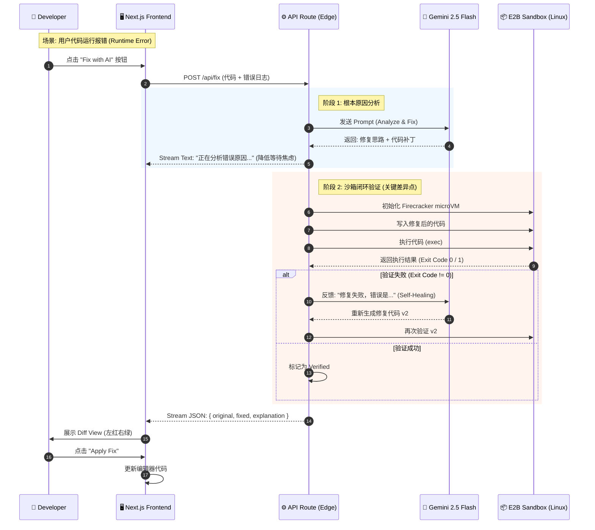

# Codex IDE————https://codefixer-pro-demo-vec4.vercel.app/

A professional, VS Code-like IDE interface built with modern web technologies.

## 🏗 System Architecture

The following diagram illustrates the data flow and the "Self-Healing" verification loop implemented in CodeFixer Pro.

```mermaid
graph TD
    %% 定义样式
    classDef client fill:#e1f5fe,stroke:#01579b,stroke-width:2px;
    classDef server fill:#fff3e0,stroke:#ff6f00,stroke-width:2px;
    classDef ai fill:#f3e5f5,stroke:#7b1fa2,stroke-width:2px,stroke-dasharray: 5 5;
    classDef sandbox fill:#e8f5e9,stroke:#2e7d32,stroke-width:2px,stroke-dasharray: 5 5;

    subgraph Client_Side [💻 Frontend (Next.js Client)]
        UI[Monaco Editor & Terminal UI]:::client
        StreamParser[Stream Parser]:::client
    end

    subgraph Server_Side [⚙️ Backend (Next.js API Routes)]
        Orchestrator[Agent Orchestrator]:::server
        PromptEng[Prompt Engineer System]:::server
        DiffGen[Diff Generator]:::server
    end

    subgraph External_Services [☁️ Cloud Infrastructure]
        Gemini[Google Gemini 2.5 Flash\n(Reasoning & Code Gen)]:::ai
        E2B[E2B Code Interpreter\n(Firecracker microVM)]:::sandbox
    end

    %% 连线关系
    UI -- "1. 提交报错代码 & 错误日志" --> Orchestrator
    Orchestrator -- "2. 组装 Context" --> PromptEng
    PromptEng -- "3. 发送 Prompt" --> Gemini
    Gemini -- "4. 返回修复代码" --> Orchestrator
    Orchestrator -- "5. 注入沙箱执行 (Dry Run)" --> E2B
    E2B -- "6. 返回执行结果 (Stdout/Stderr)" --> Orchestrator
    Orchestrator -- "7. 验证成功? (Self-Correction)" --> Orchestrator
    Orchestrator -- "8. 流式返回结果 (Stream Response)" --> StreamParser
    StreamParser -- "9. 渲染 Diff View" --> UI

    %% 备注
    linkStyle 4,5 stroke:#2e7d32,stroke-width:3px;
    linkStyle 6 stroke:#ff6f00,stroke-width:3px;
```

## 🔄 Interaction Flow (Sequence)

Highlights the **Streamed Response** and **E2B Sandbox Verification** process:


## 🚀 Features

- **📁 File Explorer**: Tree view with folder expansion/collapse
- **📝 Monaco Editor**: Full-featured code editor with syntax highlighting
- **💻 Integrated Terminal**: Xterm.js powered terminal with command support
- **💬 AI Assistant**: Chat panel for code assistance
- **🔑 BYOK Support**: Bring Your Own API Key (OpenAI/Anthropic)
- **🎨 Cyberpunk Theme**: Deep midnight theme with blue/purple accents
- **📊 Resizable Panels**: Drag to resize any panel
- **⌨️ Multi-Tab Support**: Open multiple files simultaneously

## 🛠 Tech Stack

- **Framework**: Next.js 14 (App Router)
- **Language**: TypeScript
- **Styling**: Tailwind CSS
- **State Management**: Zustand
- **Editor**: Monaco Editor
- **Terminal**: Xterm.js
- **Code Execution**: E2B Code Interpreter
- **UI Components**: Shadcn UI + Lucide Icons
- **Layout**: react-resizable-panels

## 📦 Installation

```bash
# Install dependencies
npm install

# Configure E2B API Key
cp .env.local.example .env.local
# Edit .env.local and add your E2B_API_KEY

# Run development server
npm run dev
```

Open [http://localhost:3000](http://localhost:3000) to see the IDE.

### Get E2B API Key
1. Visit [E2B Dashboard](https://e2b.dev/dashboard)
2. Sign up for a free account
3. Create an API key
4. Add it to `.env.local`

## 🎯 Usage

### BYOK - Bring Your Own Key 🔑
1. Click the **Settings** icon (⚙️) in the top-right corner
2. Select your API provider (OpenAI or Anthropic)
3. Enter your API key
4. Click **Save API Key**
5. Start using AI-powered features!

**Supported Features:**
- 💚 **Google Gemini** - FREE AI coding (15 req/min)
- ▶️ **Run** - Execute Python code in E2B sandbox
- 🧠 **AI Fix** - Autonomous debugging with ReAct loop
- 🔀 **Diff View** - Side-by-side code comparison
- ✨ **Thinking UI** - Real-time agent progress display
- 💬 **Chat** - AI assistant conversations

📖 **Detailed Guides**: 
- [GEMINI_QUICK_START.md](./GEMINI_QUICK_START.md) - 💚 Get started with FREE Gemini!
- [BYOK_GUIDE.md](./BYOK_GUIDE.md) - API Key configuration
- [E2B_INTEGRATION.md](./E2B_INTEGRATION.md) - Code execution setup
- [AI_AGENT_GUIDE.md](./AI_AGENT_GUIDE.md) - Autonomous debugging agent
- [DIFF_UI_GUIDE.md](./DIFF_UI_GUIDE.md) - Diff Editor and Thinking UI

### File Explorer
- Click on files to open them in the editor
- Click on folders to expand/collapse
- Multiple files can be opened in tabs

### Editor
- Full Monaco Editor with syntax highlighting
- Supports Python, JavaScript, TypeScript, Markdown, and more
- Line numbers, minimap, and code folding
- Code action bar with Run, Fix, and Analyze buttons

### Terminal
- Type commands and press Enter
- Supported commands: `help`, `clear`, `echo`, `ls`, `pwd`, `date`, `whoami`
- View execution results from code runs

### AI Assistant
- Configure your API key in Settings
- Ask questions about your code
- Get coding suggestions and help
- Powered by OpenAI GPT or Anthropic Claude

## 🎨 Theme

The IDE uses a deep cyberpunk/midnight theme:
- Background: `#09090b`
- Primary: Blue (`#3b82f6`)
- Accent: Purple (`#a855f7`)
- Dark UI elements with high contrast

## 🔧 Configuration

Edit `store/useIDEStore.ts` to customize:
- Initial file tree structure
- Default file contents
- Terminal behavior
- UI state defaults

## 📚 Documentation

- **[BYOK_GUIDE.md](./BYOK_GUIDE.md)** - Complete BYOK usage guide
- **[E2B_INTEGRATION.md](./E2B_INTEGRATION.md)** - E2B sandbox integration guide
- **[AI_AGENT_GUIDE.md](./AI_AGENT_GUIDE.md)** - Autonomous debugging agent guide
- **[DIFF_UI_GUIDE.md](./DIFF_UI_GUIDE.md)** - Diff Editor and Thinking UI guide
- **[BYOK_DEMO.md](./BYOK_DEMO.md)** - Quick demo walkthrough
- **[BYOK_IMPLEMENTATION.md](./BYOK_IMPLEMENTATION.md)** - Technical implementation details
- **[FEATURES.md](./FEATURES.md)** - Detailed feature documentation
- **[PROJECT_STRUCTURE.md](./PROJECT_STRUCTURE.md)** - Code architecture
- **[QUICK_START.md](./QUICK_START.md)** - Getting started guide

## 🔐 Security

Your API keys are:
- ✅ Stored only in your browser's localStorage
- ✅ Never sent to our servers
- ✅ Passed directly to OpenAI/Anthropic APIs
- ✅ Encrypted in transit (HTTPS)

## 📝 License

MIT

## 🤝 Contributing

Contributions are welcome! Feel free to submit issues and pull requests.

---

Built with ❤️ using Next.js 16 and modern React

**Latest Updates:**
- **v1.6.2:** 🎯 Terminal & Chat Fix - 终端输出 + AI 助手完全修复
- **v1.6.1:** 🔧 Bug Fixes - Terminal output & API stream error resolved
- **v1.6:** 🚀 Gemini 2.5 + E2B API Fix - Latest model & `runCode()` method
- **v1.5.2:** 🛠️ E2B SDK Fix - Updated to `.kill()` method
- **v1.5.1:** 🔧 Model Version Fix - Stable `gemini-1.5-flash-latest`
- **v1.5:** 💚 Google Gemini - FREE AI coding with strict BYOK!
- **v1.4:** 🎨 Diff Editor + Thinking UI - Beautiful UX for AI fixes!
- **v1.3:** 🤖 AI Agent - Autonomous debugging with ReAct loop!
- **v1.2:** 🚀 E2B Code Interpreter - Real Python execution!
- **v1.1:** 🔑 BYOK (Bring Your Own Key) support
